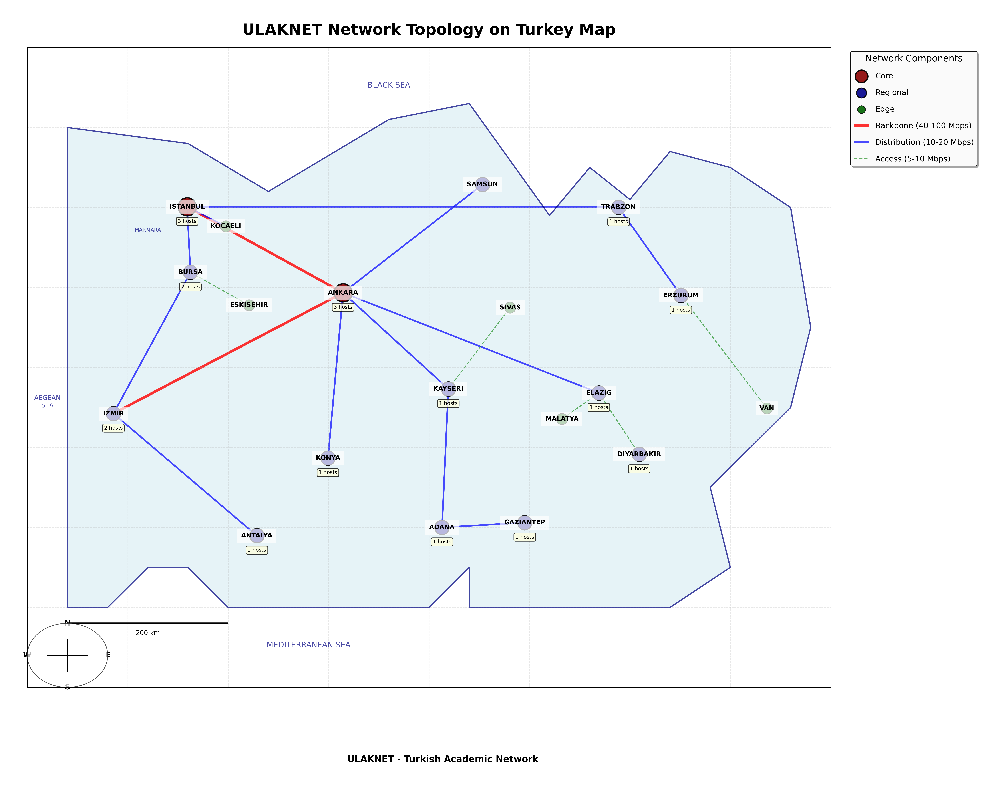

# ULAKNET Network Topology Simulation



## Overview

This project simulates the Turkish Academic Network (ULAKNET) using Mininet. It creates a realistic virtual network environment that models the core, regional, and edge nodes connecting major academic institutions across Turkey, complete with appropriate bandwidth and delay parameters.

## VM Setup Requirements

**Important:** This project requires the official Mininet VM. Before proceeding:

1. Download and set up the Mininet VM from: https://mininet.org/vm-setup-notes/
2. Follow the installation instructions on that page to get the VM running
3. Once the VM is set up, you can proceed with the rest of the installation steps

The project has been specifically tested and designed to work with this VM image. Other environments may require additional configuration.

## Project Structure

- `src/`
  - `config/` - Configuration files defining the network topology
  - `topology/` - Mininet topology implementation code
  - `visualization/` - Network visualization tools
- `scripts/` - Helper scripts for running and managing the topology
- `output/` - Generated visualization files

## Running the Simulation

1. **Prerequisites**: Make sure you have Mininet and Open vSwitch installed.

2. **Restore OVS if needed**:
   ```
   bash scripts/restart_ovs.sh
   ```

3. **Run the topology**:
   ```
   bash scripts/run_topology.sh
   ```

4. **Generate visualization only** (already done during run_topology):
   ```
   bash scripts/generate_visualization.sh
   ```

## Network Details

The network consists of:
- **Core nodes**: Ankara, Istanbul
- **Regional nodes**: Izmir, Bursa, Antalya, Adana, Trabzon, Erzurum, Elazig, Gaziantep, Kayseri, Konya, Samsun, Diyarbakir
- **Edge nodes**: Malatya, Van, Sivas, Eskisehir, Kocaeli

Links are configured with various bandwidth and delay parameters:
- **Backbone links**: 40-100 Mbps with 5-10ms delay
- **Distribution links**: 10-20 Mbps with 7-25ms delay
- **Access links**: 5-10 Mbps with 6-15ms delay

## Using the Mininet CLI

Once the topology is running, you can use the Mininet CLI to interact with the network:

- Test connectivity: `pingall`
- Test bandwidth: `iperf h1 h4`
- Run commands on hosts: `h1 ping h7`
- View topology: `net`
- Show links: `links`

## Troubleshooting

If you encounter issues:
1. Clean up any existing Mininet instances: `bash scripts/fix_network.sh`
2. Restart Open vSwitch: `bash scripts/restart_ovs.sh`
3. Run the topology: `bash scripts/run_topology.sh`

## Visualization

The network visualization is automatically generated when you run the topology and saved to `output/ulaknet_topology.png`.

## Network Testing

You can perform various tests on the network using the provided Mininet CLI:

## GitHub Repository

This project is hosted on GitHub. You can find the latest version at:
https://github.com/bariscanatakli/ulaknet-topology